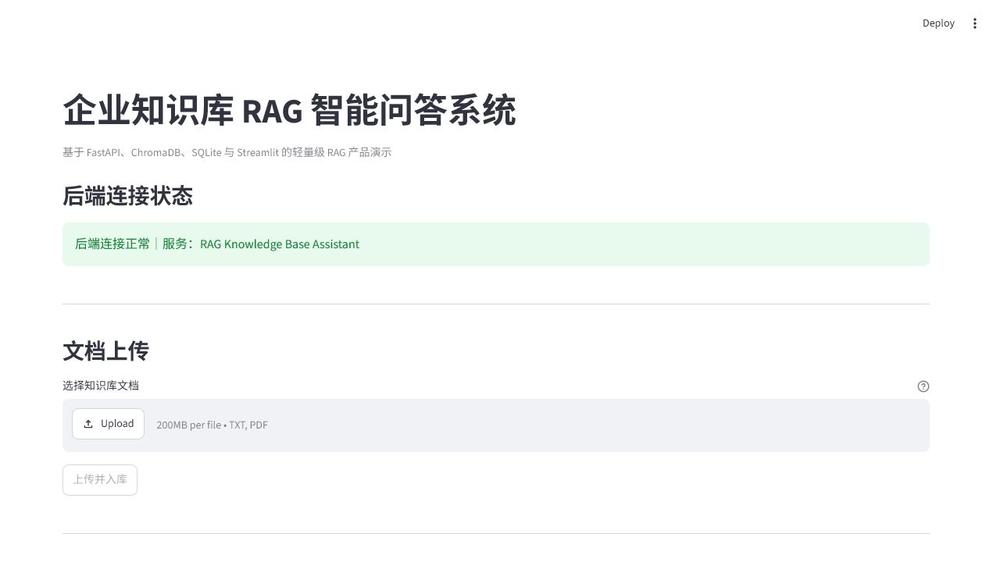
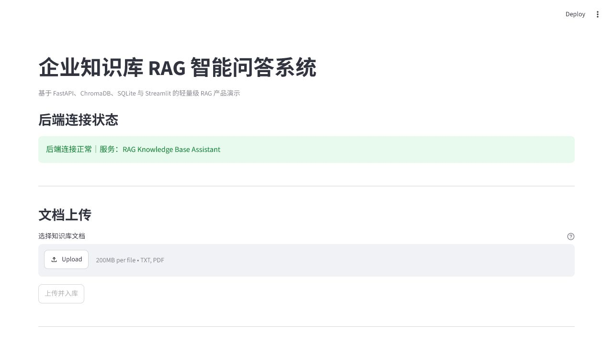

# RAG Knowledge Base Assistant

面向企业知识库场景的轻量级、可演示 RAG 智能问答系统。


## 项目背景

企业内部通常有制度、FAQ、产品和流程文档。普通大模型不了解这些私有资料，也可能在没有依据时生成看似合理但错误的回答。本项目先检索知识库，再让大模型根据检索结果回答，并向用户展示引用来源。

## 功能特性

- TXT / PDF 上传、解析、chunk 切分和向量入库
- OpenAI Embedding 与 ChromaDB cosine 检索
- 轻量 BM25 稀疏检索，支持中文双字 token 与英文错误码/配置名
- Vector、BM25、Hybrid 三种检索模式与 RRF 排名融合
- FastAPI 文档列表、详情、删除和重建接口
- SQLite 文档 metadata 与问答历史持久化
- RAG 回答、引用来源、chunk preview 和无依据提示
- Streamlit 文档上传、管理、问答、引用和历史页面
- 固定 26 题合成评估集、Hit Rate@K、Recall@K、MRR、拒答与延迟评估
- chunk_size / overlap / top_k / cosine threshold 参数实验
- 按 document_id 或 source_file 限定检索范围
- 独立 eval Chroma 库，不污染演示知识库
- `.env` 配置、基础异常处理、logging 和自动化测试

## 技术栈

- Python 3.13
- FastAPI / Uvicorn
- Streamlit / requests
- SQLite
- ChromaDB
- OpenAI Embedding API / Chat API
- pypdf / python-dotenv / pytest

## 系统架构

```text
用户
  ↓
Streamlit 前端（展示与交互）
  ↓ HTTP requests
FastAPI 后端（接口与业务调度）
  ├─ document_service
  │    ├─ document_parser
  │    ├─ chunker
  │    └─ vector_store → ChromaDB
  ├─ document_repository → SQLite documents
  └─ rag_pipeline
       ├─ retriever
       │    ├─ vector_store → vector candidates
       │    ├─ bm25_retriever → sparse candidates
       │    └─ RRF → final top-k chunks
       ├─ llm_client → answer
       └─ chat_repository → SQLite chat_history
```

Streamlit 不直接操作 ChromaDB、SQLite 或 OpenAI。RAG 与数据访问逻辑保留在 FastAPI 后端。

## RAG 流程

### 文档入库

```text
文件上传 → 保存原文件 → 解析文本 → chunk
  ├─ embedding → ChromaDB
  └─ chunk text + metadata → 由 BM25 查询时从 ChromaDB 恢复
→ SQLite 更新 indexed / chunk_count
```

### 用户查询

```text
question → Retriever
  ├─ vector：query embedding → ChromaDB cosine
  ├─ bm25：tokenize → BM25 score
  └─ hybrid：两路候选 → RRF → 去重后的 final top-k
→ context → LLM → answer + sources → SQLite history
```

## Why Hybrid Retrieval

Vector Retrieval 擅长语义改写，例如“住宿费用限制”与“酒店限额”；BM25 擅长精确词项，例如 `ERR_CONNECTION_104`、`API_TIMEOUT_MS`、函数名和政策编号。两者的原始分数量纲不同，因此项目不直接相加，而使用 Reciprocal Rank Fusion：

```text
RRF score = 1 / (RRF_K + rank)
```

同一个 chunk 同时被两路召回时，以稳定 `chunk_id` 去重，并累加两路 RRF 分数。`SIMILARITY_THRESHOLD` 只作用于 Vector 分支，不作用于 BM25 或 RRF。

### 三种模式

- `vector`：保持原有 ChromaDB cosine 检索，向后兼容的默认模式。
- `bm25`：不调用 Embedding，直接从 ChromaDB 读取持久化 chunk 文本和 metadata，在内存构建轻量 BM25 索引。
- `hybrid`：分别获取 Vector/BM25 候选，再用 RRF 融合并截取最终 Top-K。

BM25 没有维护第二份 chunk 数据。上传、删除和 rebuild 改变 ChromaDB 后，下一次 BM25 查询重新读取当前 collection，因此自然同步；服务或容器重启后也能从持久化 ChromaDB 恢复。当前方案适合教学和小规模知识库；大规模环境应升级为增量倒排索引或独立搜索服务。

### API 示例

```json
POST /chat/query
{
  "question": "ERR_CONNECTION_104 应该怎样排查？",
  "retrieval_mode": "hybrid",
  "top_k": 3,
  "similarity_threshold": 0.6,
  "document_ids": ["optional-document-id"]
}
```

响应保留原有 `answer` 和 `sources`，并增加 `retrieval_mode` 与 `retrieval_debug`。调试字段可包含 `vector_score`、`vector_rank`、`bm25_score`、`bm25_rank` 和 `rrf_score`。

### 配置项

| 变量 | 默认值 | 作用 |
|---|---:|---|
| `DEFAULT_RETRIEVAL_MODE` | `vector` | 旧请求未传模式时的默认值 |
| `VECTOR_CANDIDATE_K` | `8` | Hybrid 的 Vector 候选数 |
| `BM25_CANDIDATE_K` | `8` | Hybrid 的 BM25 候选数 |
| `RRF_K` | `60` | RRF 排名平滑常数 |
| `BACKEND_PORT` | `8000` | Docker 宿主机后端端口 |
| `FRONTEND_PORT` | `8501` | Docker 宿主机前端端口 |
| `DATA_VOLUME_NAME` | `rag-knowledge-assistant-data` | Docker 持久卷名称 |

Streamlit 查询区可选择 Vector、BM25 或 Hybrid，并在来源展开区查看两路排名和分数。

## 项目结构

```text
rag_knowledge_assistant/
  app/
    main.py
    api/
      documents.py
      chat.py
    core/
      config.py
      logging_config.py
    db/
      database.py
      document_repository.py
      chat_repository.py
    schemas/
      document.py
      chat.py
    services/
      document_parser.py
      chunker.py
      vector_store.py
      document_service.py
      rag_pipeline.py
      llm_client.py
  frontend/
    __init__.py
    api_client.py
    streamlit_app.py
  data/
    uploads/
    chroma_db/
    metadata.db
  demo/
    demo_knowledge_base.txt
    company_reimbursement_policy.txt
    product_ops_manual.txt
  evals/
    test_questions.json
    retrieval_evaluator.py
    run_eval.py
    keyword_retriever.py
    experiment_summary.csv
    experiment_notes.md
  docs/
    screenshots/
      week10-streamlit-home.png
  examples/
    manual_vector_store_demo.py
  tests/
    test_api.http
    test_frontend_api_client.py
    test_week10_backend.py
    test_chat_repository.py
    test_streamlit_app.py
  requirements.txt
  Dockerfile
  Dockerfile.frontend
  docker-compose.yml
  .dockerignore
  .env.example
  README.md
```

## API

| Method | Path | Purpose |
|---|---|---|
| GET | `/health` | 服务健康检查 |
| POST | `/documents/upload` | 上传、解析并入库文档 |
| GET | `/documents/list` | 文档列表 |
| GET | `/documents/{document_id}` | 文档详情 |
| DELETE | `/documents/{document_id}` | 删除文件、metadata 和向量 |
| POST | `/documents/{document_id}/rebuild` | 重建单个文档 |
| POST | `/documents/rebuild-all` | 重建全部文档 |
| POST | `/chat/query` | RAG 问答并保存历史 |
| GET | `/chat/history?limit=10` | 最近问答历史 |

## 本地运行

### 创建环境并安装依赖

```powershell
cd path\to\rag_knowledge_assistant
python -m venv .venv
.\.venv\Scripts\Activate.ps1
python -m pip install -r requirements.txt
```

复制 `.env.example` 为 `.env`，填写自己的 API Key。不要提交 `.env`。

### 启动 FastAPI

```powershell
python -m uvicorn app.main:app --reload --host 127.0.0.1 --port 8000
```

- Health：<http://127.0.0.1:8000/health>
- Swagger：<http://127.0.0.1:8000/docs>

### 启动 Streamlit

另开一个 PowerShell：

```powershell
cd path\to\rag_knowledge_assistant
.\.venv\Scripts\Activate.ps1
python -m streamlit run frontend/streamlit_app.py
```

访问：<http://127.0.0.1:8501>

### 使用 Docker Compose 启动

先把 `.env.example` 复制为 `.env` 并填写自己的 `OPENAI_API_KEY`，然后执行：

```powershell
docker compose up -d --build
docker compose ps
```

- Streamlit：<http://127.0.0.1:8501>
- FastAPI Health：<http://127.0.0.1:8000/health>
- Swagger：<http://127.0.0.1:8000/docs>

停止服务但保留知识库数据：

```powershell
docker compose down
```

不要随意使用 `docker compose down -v`，`-v` 会同时删除 `rag-knowledge-assistant-data` 数据卷。

## 使用流程

1. 确认页面显示“后端连接正常”。
2. 上传 TXT 或 PDF。
3. 查看 document_id、status、chunk_count 和 vector_status。
4. 输入问题并选择 top-k。
5. 查看回答、响应时间和引用来源。
6. 用文档外问题验证无依据提示。
7. 在问答历史中查看 SQLite 持久化记录。

## 演示文档与示例问题

演示文件：`demo/demo_knowledge_base.txt`

可使用以下问题验证检索、引用和拒答行为：

1. 文档内直接问题：员工每周最多可以远程办公几天？
2. 跨主题问题：差旅报销和学习预算分别有哪些时间或金额限制？
3. 文档外问题：公司股票今天多少钱？
4. 幻觉测试：请确认员工都可以报销商务舱费用。
5. 引用测试：发生设备遗失时应该怎么做？请给出依据。

## 示例返回

```json
{
  "question": "员工每周最多可以远程办公几天？",
  "answer": "根据员工服务手册，员工每周最多可以申请两天远程办公。",
  "sources": [
    {
      "source_file": "demo_knowledge_base.txt",
      "chunk_id": "...",
      "distance": 0.12,
      "chunk_preview": "员工每周最多可以申请两天远程办公……"
    }
  ]
}
```

距离越小通常表示在当前 cosine distance 定义下越接近。不同指标的 score/distance 方向可能不同，不能脱离配置解释。

## 无依据拒答

当没有返回可靠 sources 时，Streamlit 明确显示：

```text
知识库中未找到可靠依据。
```

拒答行为由检索结果、相似度阈值和 prompt 约束共同控制，相关效果通过固定评估集进行验证。

## 问答历史

每次成功问答后，后端将 question、answer、sources 和 created_at 写入 SQLite `chat_history`。前端通过 `/chat/history` 获取最近十条，而不是只保存在浏览器 session。

## 项目截图





## 测试

```powershell
python -m pytest -q -p no:cacheprovider
```

`tests/test_api.http` 用于 IDE 手动接口测试，不由 pytest 收集。`examples/manual_vector_store_demo.py` 是需要真实 API Key 的手动演示，不属于自动化测试。

## 检索评估与优化

评估实验数据与 collection 只写入 `data/eval_chroma_db/`，运行时知识库 `data/chroma_db/` 不参与参数实验。

### 固定问题集

`evals/test_questions.json` 包含 20 道题：8 道直接题、4 道跨 chunk 题、4 道文档外题、2 道易幻觉题和 2 道引用检查题。每题记录 expected_answer、expected_source 和 should_refuse。

### 指标

- hit rate：正确来源是否进入 top-k。
- answer accuracy：最终答案是否覆盖人工金标准关键点。
- refusal accuracy：文档外问题是否拒答，同时文档内问题是否避免误拒答。

### 真实结果摘要

baseline（500/50、top_k=3）：retrieval hit rate 1.00，20 题人工 answer accuracy 1.00，refusal accuracy 1.00。

三组 chunk 参数的 hit rate 均为 1.00。当前题集没有区分出显著差异，因此不能声称某组 chunk 参数更优；暂时保留中间值 500/50。

top_k=3、5、8 的 hit rate 都是 1.00，但平均返回 chunk 分别为 3、5、6。当前推荐 top_k=3，避免在命中没有提升时扩大 context 噪声。

threshold probe 显示正确来源 distance 约为 0.256–0.549，文档外问题最小 distance 约为 0.761–0.954：

| threshold | hit rate | refusal accuracy | 平均返回数 |
|---:|---:|---:|---:|
| 0.45 | 0.50 | 0.60 | 0.45 |
| 0.60 | 1.00 | 1.00 | 1.90 |
| 0.80 | 1.00 | 0.95 | 4.75 |

当前固定集推荐 0.60。该数值依赖当前 embedding、cosine distance、文档和问题分布，更换条件后必须重新评估。

完整结果见 `evals/experiment_summary.csv` 和 `evals/experiment_notes.md`。

### 运行实验

```powershell
cd path\to\rag_knowledge_assistant
.\.venv\Scripts\python.exe -m evals.run_eval baseline --with-answers
.\.venv\Scripts\python.exe -m evals.run_eval chunk
.\.venv\Scripts\python.exe -m evals.run_eval top-k
.\.venv\Scripts\python.exe -m evals.run_eval threshold-probe
.\.venv\Scripts\python.exe -m evals.run_eval threshold --thresholds 0.45 0.60 0.80
.\.venv\Scripts\python.exe -m evals.run_eval filter
.\.venv\Scripts\python.exe -m evals.run_retrieval_comparison
```

三模式逐题结果写入 `evals/retrieval_mode_comparison.csv`，分类汇总写入 `evals/retrieval_mode_summary.csv`。Vector/Hybrid 评估会调用当前配置的 Embedding API；只有在明确允许合成 demo 文档发送到该端点时运行。不要用私人上传文档做公开评估。

### metadata filtering

`POST /chat/query` 现在支持可选字段：

```json
{
  "question": "报销提交时限是什么？",
  "top_k": 3,
  "similarity_threshold": 0.6,
  "source_files": ["company_reimbursement_policy.txt"]
}
```

也可以传入 `document_ids`。不传过滤字段时仍然全库检索。metadata filter 是范围约束，不等于权限系统。

### Keyword、BM25、Vector 与 Rerank

- `keyword_retriever.py` 是透明的字面匹配基线，不是 BM25。
- BM25 进一步考虑词频、逆文档频率和文档长度，适合精确术语与编号。
- vector search 更擅长语义改写和近义表达。
- hybrid search 可以合并 keyword/BM25 与 vector 的候选。
- rerank 位于初召回之后，对候选重新排序。

本项目尚未实现正式 BM25、hybrid fusion 或外部 reranker，不把设计说明写成已部署能力。

## 已知限制

- 只支持 TXT 和基础 PDF 文本解析，不支持复杂表格与版面理解。
- 上传和 embedding 是同步流程，大文件会阻塞请求。
- 没有登录、权限、多租户和审计系统。
- 评估集只有 20 题和短 demo 文档，尚不是生产级评估体系。
- answer accuracy 为单人逐题复核，没有多人标注一致性。
- 尚未实现正式 BM25、hybrid search 或 rerank。
- 依赖外部 Embedding 与 LLM API，受网络、配额和费用影响。
- Streamlit 适合快速演示，不等同于复杂生产前端。

## Docker 容器化

- 后端与前端分别使用 Dockerfile 构建，Compose 统一编排。
- 本地默认 API 地址保持不变；容器通过 `API_BASE_URL=http://backend:8000` 通信。
- backend 和 frontend 都配置了真实 HTTP 健康检查。
- 使用 `rag-knowledge-assistant-data` 命名卷持久化 SQLite、ChromaDB 与上传文件。
- 镜像构建、双服务健康检查、宿主机 HTTP、容器间通信、后端重启和浏览器页面渲染均已验证。
- 架构说明见 `docs/architecture.md`。
